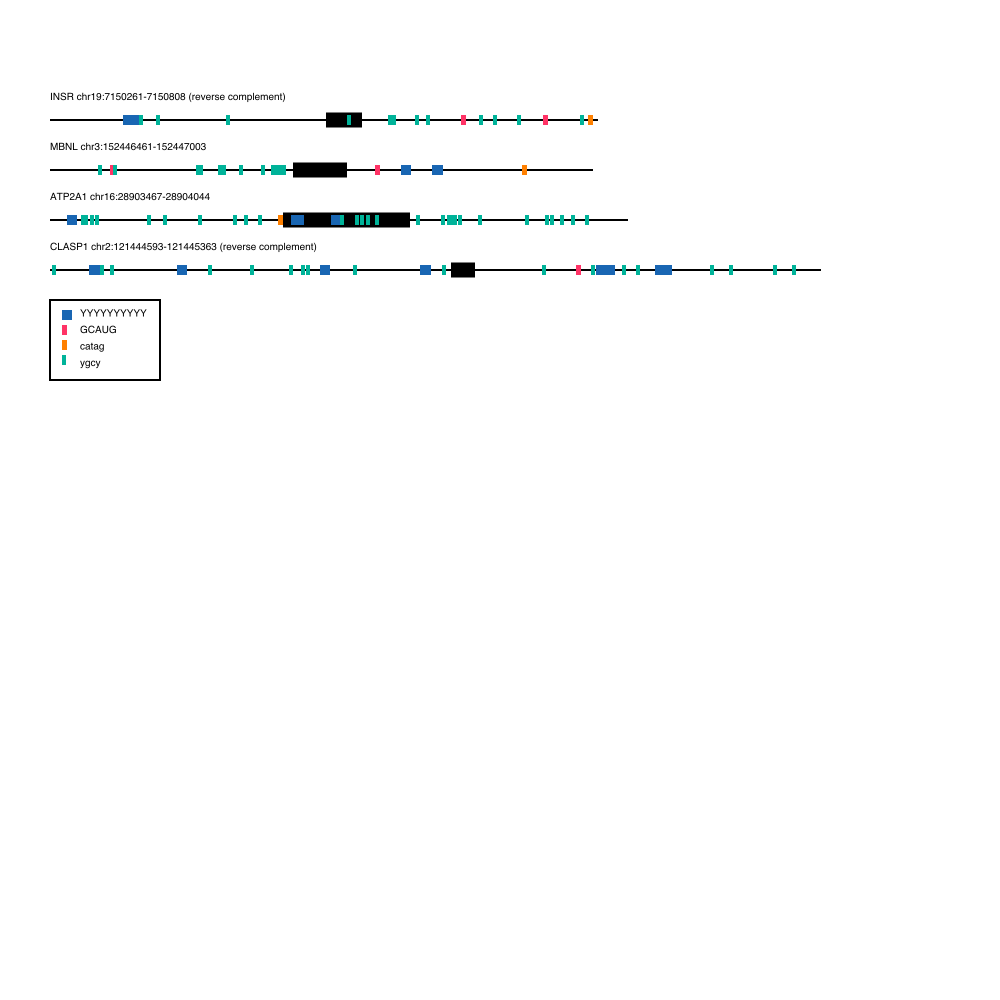

# Motif Mark: OOP

Motif Mark is a Python3-based script that allows the user to visualize genes and where motifs occur on them. It creates a color-coded image (.svg) using a fasta file and text file of motif sequences.

## Output


## Requirements

Motif Mark requires two files:   
• a fasta file, where every exon is denoted by upper case letters introns by lower case letters  
• a text file of motifs, where every motif sequence is on a new line and follows IUPAC notation.  

An example fasta file and motif file is found in this repo under ex_fasta.fasta and ex_motif.txt, respectively.

Currently accepts only one exon per gene, and up to six motifs.

## Installation

To run Motif Mark on your own computer, you will need the following Python modules:  
• argparse  
• re  
• cairo  

## Usage
```
$ ./motif-mark-oop.py --help

usage: motif-mark-oop.py [-h] -f FASTA -m MOTIFS

Given a fasta file of genes and a text file of motifs, outputs an vector image of a gene and its motifs to scale.

optional arguments:
  -h, --help            show this help message and exit
  -f FASTA, --fasta FASTA
                        Absolute path to fasta file of genes, where introns are in lower case and exons are in upper case.
  -m MOTIFS, --motifs MOTIFS
                        Absolute path to text file containing a list of motifs, where each motif is on a new line. Accepts all IUPAC
                        degenerate base symbols.
 ```
 
 Example
 
 ```$ ./motif-mark-oop.py -f example_fasta.fasta -m example_motifs.txt```
 
 
